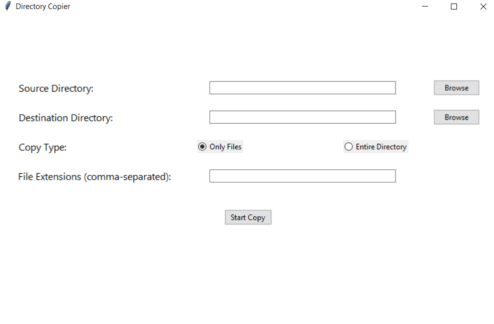
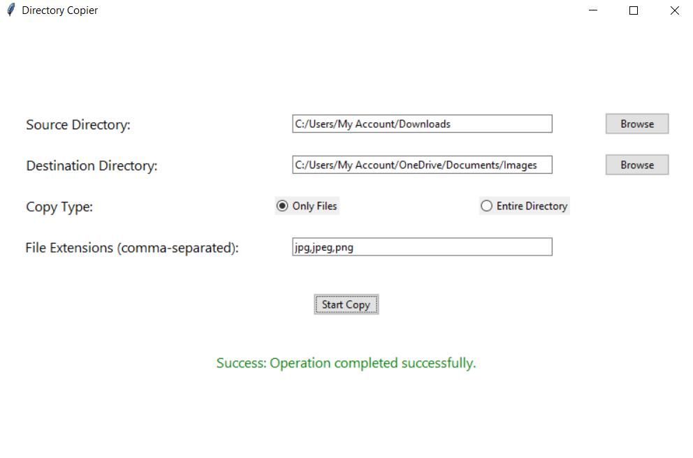
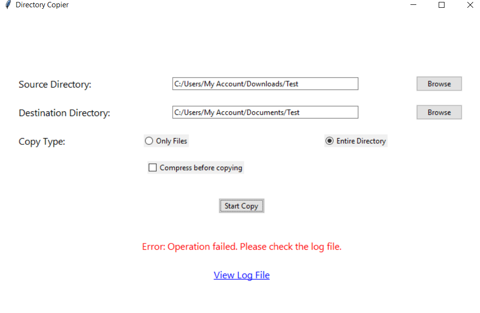

# Copy Specific Files or Folders
**Directory Copier** is a user-friendly GUI tool built using Python and Tkinter that simplifies the process of copying files or entire directories. The tool includes features such as selective file extension filtering and detailed logging for every operation. 

⚠ **Note:** The compression feature is planned but not implemented yet.

## Features

- Copy individual files based on specific extensions.
- Copy entire directories (without compression for now).
- Real-time success/error status displayed at the bottom of the screen.
- Access to detailed log files for debugging and tracking operations.
- Intuitive graphical interface for easy navigation and use.

## Prerequisites

- Python 3.7 or higher
- Required Python libraries:
  - `tkinter` (comes pre-installed with Python)
  - `Pillow`
  - `shutil` (built-in)
  
To install additional dependencies, run:
```bash
pip install pillow
```

## How to Use
- Clone the repository
```bash
git clone https://github.com/AbhiramiTS/copy-files-and-folders.git
```

- Run the script:
```bash
python user_input.py
```

## Screenshots

### Main Interface


### Copying Files with Specific Extensions


### Log File View Option


---

## How to Use the GUI:

1. **Select Source and Destination Directories**:
   - Use the **Browse** buttons to select the source and destination directories from your file system.
   - Or you can **type the path** directly into the input boxes for both source and destination locations.

2. **Choose File Type or Entire Directory**:
   - Select whether you want to copy **specific file types (by extension)** or copy **entire directories**.

3. **Compression Options**:
   - **Compression options are not available for now.**

4. **Start the Copy Process**:
   - Click the **Start Copy** button to begin copying the selected files or folders from the source to the destination.

5. **View Logs**:
   - After the operation, you can click the **View Log File** link to view the log of the copy process (if available), to monitor progress and troubleshoot any issues.


